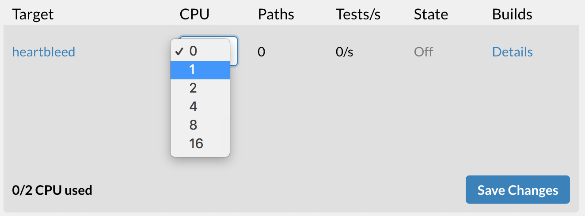

# Heartbleed in 5 minutes


If you haven't set up your account yet, we recommend you check out the Find your first bug tutorials - they're really quick, and they'll help you get started!


## Step 1: Get the code

First, clone the tutorial code to your machine:

```bash
git clone https://github.com/fuzzbuzz/heartbleed-tutorial.git
```

## Step 2: Code Review

The repository contains a `fuzzbuzz.yaml` file, which is how Fuzzbuzz is configured, along with a C++ file, the OpenSSL source, and a `build.sh` file. This section will quickly walk you through all of these files.

### target.cc

This file contains `FuzzerEntrypoint`, the method that Fuzzbuzz will run repeatedly with the tests it generates. This method attempts to make the OpenSSL handshake with the `Data` provided.



```c
#include <openssl/ssl.h>
#include <openssl/err.h>
#include <assert.h>
#include <stdint.h>
#include <stddef.h>

SSL_CTX *Init() {
  SSL_library_init();
  SSL_load_error_strings();
  ERR_load_BIO_strings();
  OpenSSL_add_all_algorithms();
  SSL_CTX *sctx;
  assert (sctx = SSL_CTX_new(TLSv1_method()));
  /* These two file were created with this command:
      openssl req -x509 -newkey rsa:512 -keyout server.key \
     -out server.pem -days 9999 -nodes -subj /CN=a/
  */
  assert(SSL_CTX_use_certificate_file(sctx, "runtime/server.pem",
                                      SSL_FILETYPE_PEM));
  assert(SSL_CTX_use_PrivateKey_file(sctx, "runtime/server.key",
                                     SSL_FILETYPE_PEM));
  return sctx;
}

extern "C" int FuzzerEntrypoint(const uint8_t *Data, size_t Size) {
  static SSL_CTX *sctx = Init();
  SSL *server = SSL_new(sctx);
  BIO *sinbio = BIO_new(BIO_s_mem());
  BIO *soutbio = BIO_new(BIO_s_mem());
  SSL_set_bio(server, sinbio, soutbio);
  SSL_set_accept_state(server);
  BIO_write(sinbio, Data, Size);
  SSL_do_handshake(server);
  SSL_free(server);
  return 0;
}
```



### build.sh

This file contains the build steps for the target, and is an example of how to test a library. The first step builds OpenSSL for fuzzing by injecting the compiler \(`FUZZ_CC`\) and `CFLAGS` that Fuzzbuzz provides. Then, it links `target.cc` to the OpenSSL libraries we just built, and to the `FUZZ_ENGINE` Fuzzbuzz provides.



```c
#!/bin/bash
# Copyright 2016 Google Inc. All Rights Reserved.
# Licensed under the Apache License, Version 2.0 (the "License");

set -x
set -e
set -o pipefail

cd openssl_src && CC="$FUZZ_CC $CFLAGS" ./config && make clean && make
cd ..
$FUZZ_CXX $CXXFLAGS ./target.cc -DCERT_PATH=\"$PWD/runtime\"  openssl_src/libssl.a openssl_src/libcrypto.a $FUZZ_ENGINE -I openssl_src/include -o ./target
```



### fuzzbuzz.yaml

This is how you provide your configuration to Fuzzbuzz. It allows you to install any dependencies, tells Fuzzbuzz what parts of your code to test, and allows you to configure more advanced constraints to make your code more efficient.



```yaml
base: ubuntu:16.04
language: c++
setup:
  - sudo chmod 775 ./build.sh
  - sudo apt-get -y install git make
  - ./build.sh
targets:
  - name: heartbleed
    harness:
      binary: ./target
    sanitizers:
      address: detect_stack_use_after_return=1
```



This `fuzzbuzz.yaml` is very basic. It defines the base operating system to build and fuzz code in, and has configuration for a target named `heartbleed`. Every target has a corresponding method or binary that it represents.

The target configuration defines the language and version to use, as well as the method to test, where to find and import it, and the initial test corpus. You can learn more about other configuration options by reading the [Target Documentation ](../developer-documentation/targets.md)page.

## Step 3: Set up your project


Before moving on, make sure that you've set up your project and CLI as described [here](../getting-started/find-your-first-bug-in-c++/installation-and-setup.md).


We'll use the Fuzzbuzz CLI to deploy code directly, rather than pulling from a GitHub repository.

To make sure everything is working, run this command from the tutorial directory:

```text
fuzzbuzz validate
```

You should see that Fuzzbuzz reads the fuzzbuzz.yaml and detects the one target we have, called "heartbleed". Finally, you can run:

```text
fuzzbuzz project create
```

Choose Zip File, give your project a Name and Description, and then wait as the tutorial project is bundled up and deployed to Fuzzbuzz. If you head to [https://app.fuzzbuzz.io](https://app.fuzzbuzz.io/), you should see your new project waiting for you in the sidebar.After creating your project, your dashboard should look something like this.


## Step 4: Fuzz OpenSSL & find Heartbleed!

Give the `heartbleed` target 1 CPU to fuzz on, and press "Save Changes".



A few minutes after the target begins fuzzing, you should see an entry pop up in the list of bugs. Congratulations - you've just found Heartbleed with Fuzzbuzz!

